# HerbWire V2

<div align="center">

### A provenance-first medicinal-plant encyclopedia and traditional-medicine discovery platform

[](https://www.python.org/)
[](https://fastapi.tiangolo.com/)
[](https://react.dev/)
[](https://www.postgresql.org/)
[](https://www.zyte.com/)
[](https://www.heroku.com/)

**Explore medicinal plants. Follow emerging research. See the evidence behind every claim.**

</div>

---

## About HerbWire

HerbWire V2 is an English-language knowledge and editorial platform dedicated to medicinal plants and traditional systems of medicine around the world. It brings together a curated encyclopedia, research and cultural discovery briefs, and stories about natural materials and craft—all within a traceable, safety-conscious publishing workflow.

The platform collects material from approved international sources, preserves original-language provenance, resolves botanical identity, evaluates evidence and safety, creates structured English drafts, and routes every publishable item through human editorial approval.

HerbWire is designed around one central principle: **knowledge should remain connected to its source**. Public content can be traced through structured claims, source records, evidence excerpts, editorial decisions, and immutable publication versions.

> **Editorial and safety position:** HerbWire documents traditional use and scientific research; it does not diagnose, prescribe, recommend personalized treatment or dosage, or present traditional practice as proven clinical efficacy.

## What the platform offers

### Medicinal Plant Encyclopedia

Structured, reviewed plant profiles combine accepted scientific names, synonyms, botanical identity, documented traditional uses, plant parts and preparation contexts, geographic distribution, conservation, evidence limitations, safety information, licensed media, and complete source attribution.

### Traditional Medicine Discoveries

Evidence-qualified briefs make new research and developments easier to explore across areas such as medicinal-plant science, pharmacopoeias, cultivation, conservation, authentication, regulation, cultural heritage, and knowledge digitization.

### Materials & Craft

A distinct non-medical collection explores natural materials, making traditions, tools, vessels, and the botanical and cultural knowledge carried by responsibly sourced craft practices.

### Editorial Desk & Pipeline Monitor

The protected editorial workspace brings source evidence, claim coverage, safety checks, review decisions, pipeline stages, retries, run history, and publication controls into one operational surface.

## Highlights

- **International source discovery** across authoritative botanical databases, research indexes, institutions, and approved web sources.
- **Full provenance** from the collected record to the published claim and editorial decision.
- **Twelve-agent editorial architecture** with explicit responsibilities and persisted stage results.
- **Keyword-based RAG** grounded in reviewed HerbWire records, normalized plant names, source metadata, and structured filters—without embeddings or a vector database.
- **Botanical identity protection** using accepted taxa, verified synonyms, stable identifiers, and ambiguity holds.
- **Evidence-aware writing** that keeps traditional knowledge, preclinical findings, clinical research, and editorial interpretation distinct.
- **Safety-first publication gates** for contraindications, interactions, vulnerable populations, unsupported claims, and missing evidence.
- **Multilingual provenance with English output**, preserving original language, translation metadata, and reviewer visibility.
- **Licensed media and map-ready geography** with creator, source, license, checksum, and relevance validation.
- **Zyte-powered collection support** for approved institutional websites when native APIs or feeds are not suitable.
- **Heroku container deployment** with a combined React/FastAPI runtime, PostgreSQL, and release-phase Alembic migrations.
- **Human approval before publication** with auditable approve, hold, reject, correction, unpublish, and rollback paths.

## The twelve logical agents

HerbWire uses logical agents as bounded modules inside a modular monolith. They are coordinated by a Pipeline Orchestrator, share explicit contracts, and persist their outputs in PostgreSQL.

| # | Agent | Responsibility |
|---:|---|---|
| 1 | **Source Registry & Schedule Manager** | Maintains approved sources, collection policies, schedules, rate limits, and deterministic job keys. |
| 2 | **Collector Gateway** | Collects source material through provider adapters including PubMed, native HTTP/XML feeds, and Zyte. |
| 3 | **Normalization & Deduplication** | Converts provider payloads into canonical records and prevents duplicate processing by stable IDs, DOI, PMID, canonical URL, and content hash. |
| 4 | **Language, Translation & Entity Enrichment** | Detects language, preserves original text, prepares English working content, and extracts plants, regions, traditions, institutions, and safety terms. |
| 5 | **Botanical Resolver** | Resolves plant mentions to accepted taxa and holds ambiguous identities for review. |
| 6 | **Relevance & Classification** | Determines whether a record belongs in HerbWire and selects its editorial route. |
| 7 | **Evidence, Safety & Provenance** | Builds claim-support packages, evidence labels, risk flags, and source-coverage data. |
| 8 | **Content Composer** | Produces structured English Plant Profiles and Discovery Briefs from approved evidence packages. |
| 9 | **Media & Geography** | Validates licensed imagery, builds attribution, normalizes distribution data, and prepares map-ready geography. |
| 10 | **Related Content** | Connects plants and articles through explainable botanical, geographic, cultural, and editorial relationships. |
| 11 | **Editorial QA** | Checks completeness, citation integrity, safety language, translation provenance, licensing, readability, and publication eligibility. |
| 12 | **Serialization & Publisher** | Publishes an approved immutable version atomically and records its checksum, URL, timestamp, and audit event. |

The **Pipeline Orchestrator** is the coordinating platform component. It owns state transitions, retries, leases, timeouts, concurrency, recovery, and stage versions; it never changes editorial meaning or grants publication approval.

## How content moves through HerbWire

```mermaid
flowchart LR
    A[Approved sources] --> B[Collect]
    B --> C[Normalize & deduplicate]
    C --> D[Translate & enrich]
    D --> E[Resolve botanical identity]
    E --> F[Classify relevance]
    F --> G[Assess evidence, safety & provenance]
    G --> H[Keyword-based retrieval augmentation]
    H --> I[Compose structured draft]
    I --> J[Add licensed media, maps & relations]
    J --> K[Editorial QA]
    K --> L{Human review}
    L -->|Changes requested| I
    L -->|Held or rejected| M[Private editorial record]
    L -->|Approved| N[Atomic publication]
```



Every stage is persisted and reviewable. A successful automated run creates an editorially reviewable result—not an automatic medical conclusion and not an automatic publication.

## Transparent, keyword-based RAG

HerbWire uses a deterministic retrieval-augmented approach built around **keywords and structured metadata rather than embeddings**. Retrieval uses normalized scientific and common names, synonyms, source identifiers, taxonomy, regions, traditional systems, categories, and PostgreSQL text matching to locate relevant reviewed material.

The retrieved records remain connected to source excerpts and claim identifiers as they enter the content workflow. This makes the grounding path inspectable, supports deterministic fallbacks, and avoids introducing a separate vector database into a provenance-sensitive editorial system.

## Architecture

HerbWire is a **modular monolith**: one repository and one deployable application, with clear boundaries between the frontend, API, persistence, collectors, domain logic, orchestration, editorial review, and publishing.

```text
Browser
  └── React + TypeScript + Vite
        └── FastAPI REST API
              ├── Public encyclopedia, discoveries and materials
              ├── Authenticated Editorial Desk
              ├── Pipeline Orchestrator + logical agents
              ├── Provider adapters: PubMed, Zyte and curated sources
              └── SQLAlchemy + Alembic
                    └── PostgreSQL (canonical system of record)
```

This structure keeps deployment straightforward while preserving strong domain ownership. The frontend never connects directly to PostgreSQL, collectors never publish content, the composer never establishes botanical or safety truth, and only the Publisher can expose a version after explicit human approval.

## Technology stack

| Layer | Technology |
|---|---|
| Frontend | React 19, TypeScript, Vite, Tailwind CSS, React Router |
| Backend API | Python 3.13, FastAPI, Pydantic |
| Persistence | PostgreSQL 17, SQLAlchemy 2, Psycopg, Alembic |
| Collection | PubMed E-utilities, provider adapters, Zyte/Scrapy Cloud integration |
| Retrieval | PostgreSQL keyword/text matching, normalized names, metadata and structured filters |
| Testing | Pytest, Vitest, Testing Library, Ruff, ESLint, TypeScript |
| Packaging | Multi-stage Docker build |
| Deployment | Heroku Container Registry/runtime with Heroku Postgres |

## Public and editorial experiences

Public readers can:

- browse and search reviewed plant profiles;
- filter plants by family and editorial tags;
- explore discovery briefs by plant, study type, evidence strength, year, and research geography;
- read Materials & Craft stories;
- inspect citations, attribution, evidence limitations, safety notes, and maps.

Authenticated editors can:

- launch bounded Plant and Discovery pipeline runs;
- follow persisted stages and recovery state;
- compare drafts with their sources and claim coverage;
- inspect botanical, evidence, safety, translation, media, and geography checks;
- approve, request changes, hold, reject, publish, correct, or unpublish content;
- review source records, audit history, and per-agent operational results.

## Data integrity and safety

HerbWire treats provenance and editorial safety as core data, not decorative text:

- PostgreSQL is the canonical store for sources, pipeline state, content versions, reviews, and publications.
- Stable identifiers and database constraints enforce idempotency and prevent duplicate content.
- Source records and published versions preserve history rather than being silently overwritten.
- Traditional-use claims must name their tradition, region, or source and remain explicitly qualified.
- Unresolved botanical identity, unsupported factual claims, missing safety context, and high-risk flags block publication.
- Public content requires a separate, explicit human approval decision.

## Local development

### Prerequisites

- Python 3.13+
- Node.js 22+
- Docker Desktop with Docker Compose
- Git

### 1. Configure the environment

From the repository root in PowerShell:

```powershell
Copy-Item .env.example .env
python -m venv .venv
.\.venv\Scripts\python.exe -m pip install -e ".[dev]"
```

Replace the safe placeholders in `.env` with local-only values. Never commit `.env` or credentials.

### 2. Start PostgreSQL and migrate

```powershell
docker compose config
docker compose up -d postgres
.\.venv\Scripts\python.exe -m alembic -c backend\alembic.ini upgrade head
```

### 3. Install and start the frontend

```powershell
Set-Location frontend
npm ci
npm run dev -- --host 127.0.0.1 --port 5173 --strictPort
```

### 4. Start the API

Open a second PowerShell terminal at the repository root:

```powershell
.\.venv\Scripts\python.exe -m uvicorn backend.app.main:app --host 127.0.0.1 --port 8000
```

### Local URLs

| Surface | URL |
|---|---|
| Public homepage | `http://127.0.0.1:5173/` |
| Plant encyclopedia | `http://127.0.0.1:5173/plants` |
| Discovery archive | `http://127.0.0.1:5173/discoveries` |
| Materials & Craft | `http://127.0.0.1:5173/materials-and-craft` |
| Editorial login | `http://127.0.0.1:5173/login` |
| Editorial Desk | `http://127.0.0.1:5173/admin` |
| Interactive API docs | `http://127.0.0.1:8000/docs` |

## Verification

Run backend checks from the repository root:

```powershell
.\.venv\Scripts\python.exe -m ruff check backend
.\.venv\Scripts\python.exe -m ruff format --check backend
.\.venv\Scripts\python.exe -m pytest backend\tests -q
```

Run frontend checks from `frontend/`:

```powershell
npm run lint
npm run test
npm run typecheck
npm run build
```

The repository also includes end-to-end verification wrappers:

```powershell
powershell -ExecutionPolicy Bypass -File scripts\verify.ps1
```

```bash
./scripts/verify.sh
```

## Deployment

HerbWire is packaged as a multi-stage Docker application and deployed through Heroku. The frontend is compiled into static assets and served by the FastAPI process, giving the browser same-origin access to the API. Heroku’s release phase runs forward-only Alembic migrations before the web process starts, and the runtime binds to the platform-provided `PORT`.

Deployment configuration lives in [`heroku.yml`](heroku.yml), [`Dockerfile`](Dockerfile), and the detailed [`Heroku deployment runbook`](docs/architecture/DEPLOYMENT.md).

Zyte is integrated behind the Collector Gateway for source-specific, policy-approved web collection. HerbWire retains the canonical records, pipeline state, editorial decisions, and long-term provenance in PostgreSQL.

## API overview

Core public and authentication routes include:

```text
GET  /api/v1/health
GET  /api/v1/version
GET  /api/v1/plants
GET  /api/v1/plants/{slug}
GET  /api/v1/discoveries
GET  /api/v1/discoveries/{slug}
GET  /api/v1/materials
GET  /api/v1/materials/{slug}
POST /api/v1/newsletter/subscriptions
POST /api/v1/auth/login
POST /api/v1/auth/logout
GET  /api/v1/auth/session
```

Authenticated routes under `/api/v1/admin/` provide review queues, source catalogues, pipeline controls, persisted run state, approval actions, and publication operations.

## Repository map

```text
HerbWire_version2/
├── backend/
│   ├── alembic/          # Database migrations
│   ├── app/
│   │   ├── api/          # FastAPI routes and schemas
│   │   ├── collectors/   # PubMed, Zyte and provider contracts
│   │   ├── domains/      # Encyclopedia, discovery, materials and pipelines
│   │   └── workers/      # Invocable operational entry points
│   └── tests/            # Unit, API and integration tests
├── frontend/
│   ├── public/media/     # Licensed, validated local media
│   └── src/              # React application
├── docs/
│   ├── architecture/     # Operational architecture notes
│   ├── decisions/        # Architecture Decision Records
│   └── specs/            # Authoritative product specification
├── scripts/              # Import and verification commands
├── compose.yaml          # Local PostgreSQL
├── Dockerfile            # Production container
└── heroku.yml            # Heroku build, release and runtime definition
```

## Documentation

- [Authoritative HerbWire specification](docs/specs/HERBWIRE_SPEC.md)
- [Sequential Plant Pipeline](docs/architecture/SEQUENTIAL_PLANT_PIPELINE.md)
- [Discovery Pipeline](docs/architecture/DISCOVERY_4A.md)
- [Heroku deployment](docs/architecture/DEPLOYMENT.md)
- [Architecture decisions](docs/decisions/)
- [Encyclopedia corpus operations](docs/encyclopedia-corpus.md)

## Responsible use

HerbWire is an educational and editorial information platform. Its content is not medical advice and is not a substitute for advice, diagnosis, or treatment from a qualified healthcare professional. Traditional knowledge is presented with attribution and context; research findings are presented with their evidence level and limitations.

---

<div align="center">

**HerbWire V2 — botanical knowledge with evidence, provenance, and human judgment.**

</div>
