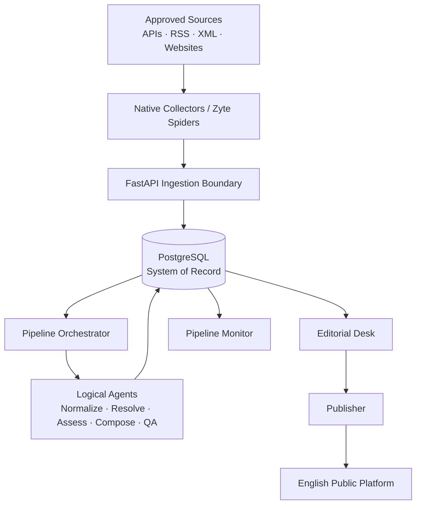
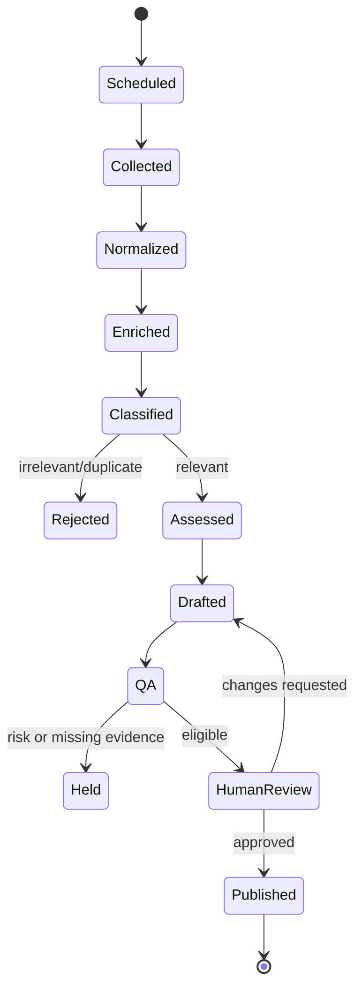
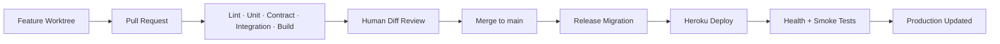

# HerbWire V2

## Automated Medicinal-Plant Encyclopedia and Traditional-Medicine Editorial Platform

**Functional and Technical Specification — Version 1.0**  
**Status:** Architecture baseline for implementation  
**Language:** English-only product and editorial output  
**Date:** 29 August 2026  
**Owner:** Hafsa Barouj  
**Document role:** Authoritative product, data, pipeline, repository, AI-agent, safety, deployment, and delivery specification

> **Safety position.** HerbWire documents medicinal plants, traditional medical systems, cultural knowledge, and relevant discoveries. It does not diagnose, prescribe, recommend personalized treatment, or present traditional use as proven clinical efficacy. Every public claim must be attributable, appropriately qualified, and reviewable.

---

# Document Control

## Purpose of this specification

This document is the implementation contract for HerbWire V2. It exists to prevent architectural drift, blind coding, duplicate abstractions, arbitrary folders, unverified medical claims, untraceable generated content, and deployment decisions made too late. When a prompt, plan, issue, or implementation choice conflicts with this specification, the specification wins until an approved Architecture Decision Record (ADR) changes it.

The specification takes structural inspiration from the supplied *NewsFindr Automated Editorial Pipeline Functional Specification v2.2*: consistent vocabulary, explicit agent contracts, staged workflows, mandatory provenance, reference databases, editorial monitoring, configuration, observability, cost controls, phased delivery, and sign-off decisions. HerbWire does **not** reuse NewsFindr code, proprietary prompts, credentials, private integrations, or business rules.

The previous HerbWire repository is not a code donor. Its botanical color palette, visual identity, content-card ideas, and page-composition concepts may inspire the new frontend after a visual audit. All V2 implementation is clean-room work in the new repository.

## Change log

| Version | Date | Status | Summary |
|---|---:|---|---|
| 1.0 | 2026-08-29 | Baseline | Defines the English-only product, modular architecture, agents, workflows, database, Zyte integration, deployment, repository structure, Codex workflow, milestones, and acceptance gates. |

## Authority and update policy

- Changes to product scope require an update to this document and `PLANS.md`.
- Changes to architecture, persistence, deployment topology, top-level repository structure, or service boundaries require an ADR under `docs/decisions/`.
- Changes to safety policy require explicit human approval and corresponding tests.
- Source additions require an entry in the Source Registry and licensing review.
- Agents may propose changes but may not silently change this specification.
- The version in `docs/specs/HERBWIRE_SPEC.md` is authoritative after it is placed in the repository.

---

# 1. Purpose and Scope

## 1.1 Product mission

HerbWire is an English-language knowledge and editorial platform dedicated to medicinal plants and traditional systems of medicine worldwide. It combines a curated plant encyclopedia with a scheduled discovery pipeline that finds, normalizes, evaluates, drafts, reviews, and publishes relevant developments with transparent provenance.

HerbWire has three public editorial products:

1. **Medicinal Plant Encyclopedia** — reviewed, structured, comparatively stable plant profiles assembled from authoritative botanical, traditional-medicine, safety, conservation, geographic, and licensing-aware media sources.
2. **Traditional Medicine Discovery Briefs** — timely English-language articles about medicinal-plant and traditional-medicine research, pharmacopoeias, conservation, authentication, cultivation, cultural heritage, digitization, regulation, and other relevant developments.
3. **Materials & Craft Stories** — curated, non-medical editorial stories about natural materials, making practices, tools, vessels, and the botanical and cultural knowledge carried by responsibly sourced material traditions.

It also has two private operational products:

3. **Editorial Desk** — review queues, source evidence, claim checks, safety controls, draft comparison, publish/reject actions, and audit history.
5. **Pipeline Monitor** — scheduled runs, stages, agents, retries, failures, duration, source yield, publication outcome, and operational diagnostics.

## 1.2 Geographic scope

Coverage is international. Priority systems and regions for source discovery include:

- India: Ayurveda, Siddha, Unani, Sowa-Rigpa and documented folk traditions.
- China: Traditional Chinese Medicine and official materia medica resources.
- Korea: Korean traditional medicine and official research institutions.
- Japan: Kampo and related materia medica resources.
- Morocco and North Africa: documented ethnobotanical knowledge, pharmacopoeia material, conservation, and academic sources.
- Southeast Asia, Africa, the Middle East, Latin America, Europe, and Indigenous traditions where lawful, respectful, attributable sources exist.

Priority does not authorize scraping, cultural appropriation, or decontextualized republication. Source permission and traditional-knowledge sensitivity remain mandatory.

## 1.3 Included content

- Botanical identity, scientific nomenclature, synonyms, family, and vernacular names.
- Traditional systems and documented traditional uses.
- Plant parts used and culturally documented preparations.
- Geographic distribution and map-ready occurrence summaries.
- Conservation and sustainability information.
- Safety, contraindications, interactions, vulnerable-population warnings, and evidence limitations when documented.
- New publications and discoveries explicitly connected to medicinal plants or traditional medicine.
- Authentication, adulteration detection, cultivation, supply, conservation, pharmacopoeia, policy, and cultural-heritage developments.
- Licensed plant imagery with durable attribution metadata.
- Complete claim-to-source provenance and editorial history.

## 1.4 Explicitly excluded content

- Generic modern-medicine news without a material traditional-medicine or medicinal-plant connection.
- Personalized diagnosis, dosage, treatment plans, or replacement of professional care.
- Unverified cure claims, miracle language, detox claims, or efficacy stated as fact without appropriate evidence.
- Automated publication of home-remedy instructions without human review.
- Commercial product endorsements, affiliate marketing, supplement sales, or paid placement in MVP.
- User-generated medical advice or a chatbot answering personal health questions.
- Paid AI APIs, paid scraping services outside an activated student benefit, Apify, or cloud GPU inference.
- Automatic copying of copyrighted encyclopedia text or images.
- Direct reuse of NewsFindr or old HerbWire implementation code.

## 1.5 Success criteria

The MVP is successful when it can demonstrate, in production:

- At least 25 reviewed plant profiles across multiple regions and traditions.
- At least one complete English-language discovery brief generated from a non-English source with the original source preserved and translation provenance recorded.
- At least three approved source adapters, including one official/API source and one Zyte-hosted crawler where Zyte is justified.
- End-to-end provenance from every public factual claim to one or more stored sources.
- Human approval before public publication.
- A visible pipeline run with persisted stages, durations, retries, and outcome.
- Automated CI and deployment after validated merges to `main`.
- No secret, copyrighted full-text corpus, or unlicensed media committed to Git.
- All critical tests and safety gates passing.

---

# 2. Core Concepts and Vocabulary

| Term | Definition |
|---|---|
| Plant Profile | The published encyclopedia unit representing one accepted plant taxon and its reviewed traditional-use, distribution, media, safety, and provenance data. |
| Discovery Brief | An English editorial article about a relevant new development, grounded in one or more approved source records. |
| Material Story | A curated, non-medical public article about a natural material or making practice, with structured sections, institutional provenance, and licensed media. |
| Source | An approved origin such as an official institution, database, feed, journal index, publication, or permitted website. |
| Source Policy | Machine-readable and human-readable rules defining trust, access, licensing, rate limits, allowed fields, retention, and automation status for a source. |
| Source Record | An immutable or append-only representation of one collected item, including original metadata, normalized extract, checksum, retrieval time, and access method. |
| Claim | A discrete factual statement used in a profile or article. Claims are linked to supporting source excerpts and a reviewer state. |
| Evidence Assessment | A structured editorial classification of what a source supports; it is not a clinical diagnosis or a universal scientific verdict. |
| Traditional Use | A practice attributed to a named culture, region, medical system, or source. It must not be rendered as established efficacy. |
| Pipeline Run | One execution created by a schedule, manual action, retry, or reprocessing request. |
| Pipeline Stage | A persisted, idempotent processing unit with an input, output, status, duration, attempt count, and error record. |
| Logical Agent | A bounded module with an explicit contract. It may use deterministic code, rules, retrieval, or optional local-model assistance. It is not necessarily a microservice. |
| Editorial Gate | A rule that prevents advancement or publication until a required human or deterministic check passes. |
| Provenance | The complete path from collected source to normalized record, extracted claim, generated text, reviewer decision, and published version. |
| Reference Database | Curated structured data used repeatedly across content, such as plants, names, traditional systems, geography, and sources. |
| Provider Adapter | A replaceable implementation behind a stable interface, such as Native HTTP, PubMed, GBIF, Wikimedia Commons, or Zyte Scrapy Cloud. |

---

# 3. Product Surfaces and User Roles

## 3.1 Public surfaces

### Home

- Botanical visual identity inspired by the old HerbWire palette, not its code.
- Featured reviewed plant profiles.
- Latest discovery briefs.
- Browse-by-region and browse-by-traditional-system entry points.
- Clear editorial and safety positioning.
- Search with visible filters and empty/error/loading states.

### Encyclopedia index

- Search by accepted name, synonym, common name, vernacular name, family, region, or traditional system.
- Filters: region, family, traditional system, conservation information present, safety information present, review date.
- Cards show hero image, accepted name, selected common name, family, region/system tags, review badge, and concise neutral summary.
- No treatment claims on cards.

### Plant profile

Required presentation order:

1. Licensed hero image.
2. Caption, creator, source, license, and required attribution.
3. Accepted scientific name and common display name.
4. Botanical identity and synonyms.
5. Overview.
6. Traditional systems and documented uses, grouped by attributed tradition.
7. Parts used and documented preparation forms.
8. Distribution narrative and compact map.
9. Conservation and sustainability.
10. Evidence and limitations.
11. Safety, contraindications, interactions, and vulnerable-population notes.
12. Carefully framed traditional household-use context, only when supported and approved.
13. Sources and claim provenance.
14. Related plants and discovery briefs.
15. Last reviewed, reviewer status, and corrections link.

### Discoveries index and article page

- Categories: Research, Tradition & Heritage, Conservation, Cultivation, Authentication, Pharmacopoeia & Policy, Knowledge Digitization.
- Region, traditional-system, plant, date, and source filters.
- Article page contains hero media if licensed, headline, standfirst, publication/review metadata, body, “Why this matters,” limitations, safety note where applicable, sources, related plants, and related articles.

## 3.2 Private surfaces

### Editorial Desk

- Review queue with priority, content type, risk flags, source count, and age.
- Draft/source split view.
- Claim-to-source coverage panel.
- Safety checklist and unsupported-claim flags.
- Translation provenance and original-language view.
- Media-license approval.
- Approve, request changes, reject, unpublish, and create correction.
- Immutable audit record of every decision.

### Pipeline Monitor

- Global KPIs: runs, success rate, average duration, records collected, duplicate rate, review holds, publications, source failures.
- Recent runs timeline.
- Per-run stage graph and log summary.
- Per-agent performance: attempts, failures, latency, skipped conditions, output counts.
- Source health: last success, last failure, yield, duplicates, block rate, license review state.
- Manual retry from a safe stage with confirmation and idempotency key.
- No raw secrets or sensitive response payloads in UI logs.

## 3.3 Roles

| Role | Capabilities |
|---|---|
| Public Reader | Browse public profiles and articles; view citations and safety information. |
| Editor | Review drafts, inspect evidence, request changes, approve low-risk content, manage corrections. |
| Senior Reviewer | Approve safety-sensitive fields, evidence changes, new source activation, and publication. |
| Administrator | Manage users, schedules, source configuration, deployment settings references, and feature flags. |
| Pipeline Operator | Inspect runs, retry safe stages, pause schedules, and diagnose sources without editorial authority. |

MVP may combine Editor, Senior Reviewer, Administrator, and Pipeline Operator into one authenticated owner account, but authorization boundaries must exist in the data model and API.

---

# 4. Content Models and Editorial Requirements

## 4.1 Plant Profile content contract

### Identity fields

- `plant_id`: UUID.
- `accepted_scientific_name`: required.
- `authorship`: botanical author citation when available.
- `family_name`: required when resolved.
- `genus`, `species`, `infraspecific_rank`, `infraspecific_name`.
- `taxonomic_status`: accepted, synonym, unresolved, or disputed.
- `taxon_source`, `taxon_source_identifier`, `taxon_checked_at`.
- `display_common_name`: editorially selected English name.
- `synonyms[]`: scientific synonyms with source and status.
- `vernacular_names[]`: language, region, script, transliteration, name, source, confidence.

### Descriptive fields

- `summary`: neutral English introduction.
- `botanical_description`: identifying morphology without encouraging unsafe self-identification.
- `parts_documented[]`: leaf, root, bark, flower, fruit, seed, resin, whole plant, or other controlled term.
- `traditional_systems[]`: linked reference records.
- `traditional_uses[]`: attributed system/region, use concept, plant part, preparation context, source links, limitations, reviewer state.
- `preparation_forms[]`: infusion, decoction, powder, paste, oil, food use, or other documented form. Dosage is excluded from automated publication.
- `distribution_summary` and structured regions.
- `conservation_summary` and source-linked status.
- `evidence_summary`: plain-language limits, not a medical recommendation.
- `safety_summary`: required before publication, even if it states that verified safety information is incomplete.

### Media fields

- `hero_media_id` links to a media asset; binaries are not stored in PostgreSQL.
- Media asset stores canonical URL, cached/derivative URL when permitted, creator, publisher, license identifier, license URL, attribution text, source page, retrieved time, checksum, dimensions, and approval state.
- A media asset cannot become a hero image until license metadata and botanical relevance are approved.

### Publication fields

- `status`: draft, evidence_review, safety_review, editorial_review, approved, published, correction_pending, archived.
- `version`, `slug`, `published_at`, `last_reviewed_at`, `review_due_at`.
- `created_by`, `approved_by`, `published_by`.
- `source_coverage_score` and `safety_gate_status`.

## 4.2 Traditional-use rendering policy

Every use statement must contain attribution. The rendering pattern is:

> In **[named system/region/source]**, **[plant/part]** has traditionally been used for **[documented purpose]**. The cited source documents this use; it does not by itself establish clinical efficacy.

Forbidden transformations include:

- “traditionally used for” → “treats”;
- “studied for” → “proven to cure”;
- animal, in vitro, historical, or ethnographic evidence → human clinical recommendation;
- one regional practice → universal practice;
- missing safety data → “safe.”

## 4.3 Household-remedy section

The public label is **“Documented traditional household use”**, not “Remedies that work.” This section is optional and disabled by default for each profile.

Publication requires:

- A named authoritative or scholarly source.
- Clear cultural/system attribution.
- No individualized dosage.
- No use for emergency, serious, chronic, infectious, pregnancy-related, pediatric, psychiatric, cancer, cardiovascular, endocrine, or other high-risk conditions.
- A safety paragraph and “not a substitute for professional care” statement.
- Human approval by the Senior Reviewer role.
- Exclusion when identification confusion, toxicity, interaction, or evidence ambiguity creates unacceptable risk.

## 4.4 Discovery Brief contract

Required fields:

- `article_id`, `event_id`, `slug`, `version`.
- `headline`: factual and non-sensational.
- `standfirst`: concise explanation.
- `category`, `regions[]`, `traditional_systems[]`, `plants[]`.
- `source_publication_date`, `collected_at`, `published_at`.
- `body_blocks[]`: introduction, development, context, why-it-matters, limitations, optional safety note.
- `claims[]` linked to sources.
- `sources[]` mandatory.
- `translation_provenance` when any source is non-English.
- `media[]`, `map_data` when relevant.
- `review_state`, `risk_flags[]`, `correction_state`.

Target length is 500–900 English words for a normal brief. Short notices may be 250–450 words. Long-form features are deferred.

## 4.5 Materials & Craft Story contract

Materials & Craft is a separate curated public domain. A story must include a stable identifier and slug, versioned structured sections, a supported category and material identity, publication state and timestamp, source relationships, reading-time metadata, and licensed local media with creator, source page, license, and checksum. Geographic or cultural labels appear only when directly supported.

The current bounded implementation uses a deterministic, schema-validated curated corpus and idempotent importer. Its public list and detail APIs expose published stories only. Materials stories are non-medical: they must not be represented as Plant Profiles, Discovery Briefs, or live autonomous-pipeline output. Future collection automation may produce review candidates through the canonical provenance and human-publication boundaries, but it is not part of this increment.

## 4.6 Source coverage requirements

- Every published factual claim must link to at least one source excerpt or structured source field.
- A Discovery Brief normally requires at least two independent sources unless it is explicitly a single-source announcement or paper summary.
- Single-source pieces must be labeled and must not add unsupported external claims.
- Plant Profiles require source coverage for identity, each use group, distribution, safety, conservation, and media licensing.
- The QA agent computes coverage; a human resolves ambiguity.

---

# 5. System Architecture

## 5.1 Chosen architecture

HerbWire V2 uses a **modular monolith with separately invocable API and worker entry points**. Logical agents are Python modules with typed contracts inside one backend codebase. PostgreSQL is the system of record. The React frontend consumes a versioned FastAPI API. Scheduled web crawling may run on Zyte Scrapy Cloud; scheduled orchestration may run through GitHub Actions or the selected host, but HerbWire owns the pipeline state.

This architecture is deliberately staged:

- It demonstrates multi-agent decomposition and orchestration.
- It remains debuggable by one student.
- It avoids premature ports, service discovery, distributed tracing, and duplicate deployments.
- A logical module may be extracted into a microservice only through an ADR that proves the need.

## 5.2 Deployable units

1. **Web/API application** — FastAPI API and production-built frontend served through one deployment for the lowest-cost baseline. Separate static hosting remains an allowed later optimization.
2. **Worker command** — imports the same backend package and runs one pipeline job or one due-job batch. It is invoked by schedules or manually; it need not be a permanently running service in MVP.
3. **PostgreSQL** — canonical transactional and editorial store.
4. **Zyte Scrapy Cloud spiders** — external collection execution for approved websites that need maintained crawlers or JavaScript rendering.
5. **CI/CD workflows** — tests, builds, migrations checks, dependency audits, and gated deployment.

## 5.3 High-level architecture



## 5.4 Architectural boundaries

- Frontend never connects directly to PostgreSQL.
- Collectors do not publish content.
- Writers do not determine botanical identity or safety truth.
- Model-assisted modules never write directly to published tables.
- Publisher accepts only approved immutable content versions.
- Pipeline stages communicate through persisted contracts, not hidden global state.
- Source-specific parsing stays in collector adapters.
- Domain services do not import frontend code or deployment SDKs.
- External providers are accessed through typed interfaces with timeouts, retries, and budget limits.

## 5.5 Technology baseline

| Layer | Choice | Rationale |
|---|---|---|
| Frontend | React 19, TypeScript, Vite, React Router, Tailwind CSS | Familiar, testable, compatible with the approved botanical design direction. |
| API | FastAPI, Pydantic, Uvicorn | Typed contracts, async I/O, automatic API documentation, Python collector compatibility. |
| Persistence | PostgreSQL 17 | Strong relational integrity, JSONB where justified, full-text search, mature tooling. |
| Migrations | Alembic | Versioned reversible schema changes. |
| Optional vectors | pgvector, installed but feature-disabled until approved | Allows later grounded similarity retrieval without changing databases. |
| Crawling | Scrapy; Zyte Scrapy Cloud provider | Open-source crawling locally and current Student Pack scheduling/hosting benefit. |
| HTTP | `httpx` with bounded timeouts/retries | Async, testable clients. |
| Testing | Pytest, Ruff, frontend unit tests, Playwright for critical E2E | Layered verification. |
| Packaging | Docker for production; Compose for local dependencies | Reproducibility and deployability. |
| CI/CD | GitHub Actions | Repository-native and sufficient for tests/scheduled triggers. |
| Observability | Structured logs + database run metrics; optional New Relic student benefit | Start simple; add external telemetry when stable. |
| Runtime AI | Provider interface; no paid model API | Deterministic/template baseline, optional local LM Studio assistance, optional approved free experimental provider. |

## 5.6 AI-runtime constraint

Codex is a development assistant, not HerbWire’s production inference API. A ChatGPT/Codex subscription does not authorize the deployed application to call Codex as a backend model.

Because paid model APIs are excluded, MVP must remain functional without an online generative model:

- Extraction, normalization, taxonomy resolution, deduplication, evidence labels, safety gates, mapping data, scheduling, publishing, and monitoring are deterministic.
- Discovery briefs can begin from structured, extractive templates and human editing.
- Local LM Studio may generate drafts during supervised local/editorial sessions through a provider adapter.
- Automated cloud publication may never depend on a local laptop model being online.
- Any later free model service is experimental until limits, privacy, stability, and terms are approved through an ADR.

---

# 6. Logical Agents and Contracts

The agents below are bounded application modules, not separate network services. The Pipeline Orchestrator invokes them and persists every stage result.

## Agent 1 — Source Registry and Schedule Manager

**Purpose:** Maintain the canonical list of approved sources and determine which collection jobs are due.

**Inputs:** current time, source configuration, schedule records, pause flags, last-run state.

**Outputs:** due collection jobs containing source ID, adapter, query scope, time window, language hints, rate-limit policy, and idempotency key.

**Rules:**

- Only active, license-reviewed sources may run automatically.
- Each job has a deterministic idempotency key: source + query/window + schedule occurrence.
- Configuration changes are versioned with author and timestamp.
- Secrets are referenced by environment-variable key, never stored in configuration rows.

**Failure:** configuration errors create a blocked run and operator alert; they do not attempt collection.

**Tests:** schedule boundary, daylight-saving independence in UTC, pause/resume, duplicate occurrence, missing secret reference, inactive source.

## Agent 2 — Collector Gateway

**Purpose:** Fetch candidate records through replaceable provider adapters.

**Providers:** Native HTTP/RSS/XML, NCBI E-utilities, Europe PMC, Crossref, GBIF, Wikimedia Commons, and Zyte Scrapy Cloud.

**Input:** collection job.

**Output:** raw source envelopes with provider metadata, request URL fingerprint, retrieval timestamp, response metadata, raw payload reference or permitted extract, checksum, and collection diagnostics.

**Zyte policy:**

- Use Zyte for approved HTML sites where native feeds/APIs are unavailable or unreliable, JavaScript rendering is required, or cloud scheduling materially improves reliability.
- Do not route every API or RSS feed through Zyte.
- Zyte schedules spiders and retains job data; HerbWire ingests normalized outputs and remains the system of record.
- A spider cannot be activated until robots/terms/license review is recorded.
- Spider output must follow a versioned HerbWire ingestion schema.
- Zyte failure must not corrupt the pipeline; the source run remains retryable.

**Failure:** timeout, HTTP class, provider status, parsing status, retry-after, block indication, and bounded raw diagnostic are stored. No infinite retries.

## Agent 3 — Normalization and Deduplication

**Purpose:** Convert provider-specific envelopes into canonical source records and prevent repeated work.

**Input:** raw source envelope.

**Output:** canonical source record or duplicate link.

**Canonical fields:** source ID, external identifier, canonical URL, title, original language, authors/organization, publication date, abstract/extract, permitted raw reference, DOI, PMID, content hash, retrieval metadata.

**Deduplication order:** external stable ID → DOI → PMID → canonical URL → normalized content hash. Fuzzy title matching only proposes a possible duplicate for review; it does not silently merge.

**Idempotency:** reprocessing the same record produces no new canonical record and can create a new processing version only when parsing logic changed.

## Agent 4 — Language, Translation, and Entity Enrichment

**Purpose:** Detect source language, create an English working representation when required, and extract entities needed by later agents.

**Output language:** always English. Original text and language metadata remain available to editors.

**Entities:** plant-name candidates, traditional systems, countries/regions, institutions, publications, preparation terms, safety terms, and research categories.

**Translation requirements:** provider/model, version, timestamp, original language, confidence, untranslated spans, and human-review state. Machine translation cannot erase the original text.

**Deterministic fallback:** titles and abstracts may remain queued for human English translation when no approved free translation method exists.

## Agent 5 — Botanical Resolver

**Purpose:** Resolve plant mentions to accepted taxa and prevent synonym-driven duplication or unsafe identity assumptions.

**Input:** plant-name candidates and contextual metadata.

**Output:** accepted taxon candidate, synonyms, source identifiers, confidence, ambiguity list, and review requirement.

**Resolution strategy:** exact accepted name → exact synonym → normalized author/name match → controlled fuzzy candidates → human review.

**Gate:** ambiguous or conflicting botanical identity blocks automatic profile association. Common names alone cannot establish identity.

## Agent 6 — Relevance and Classification

**Purpose:** Decide whether a source record belongs in HerbWire and classify its editorial route.

**Classes:** plant_profile_source, research_discovery, tradition_heritage, conservation, cultivation, authentication, pharmacopoeia_policy, knowledge_digitization, irrelevant_modern_medicine, commercial, duplicate, insufficient.

**Rules:**

- A modern biomedical paper is relevant only when a medicinal plant or traditional medical practice is central to the work.
- Commercial supplement marketing is not a discovery source.
- Classification records reasons and rule/model version.
- Low confidence goes to review, not publication.

## Agent 7 — Evidence, Safety, and Provenance

**Purpose:** Create claim-support packages, editorial evidence labels, safety flags, and source coverage data.

**Evidence labels:** traditional/historical documentation; ethnobotanical observation; official monograph/pharmacopoeia; laboratory/preclinical research; observational human research; clinical research; review/synthesis; policy/regulatory; insufficient/unclear.

These labels describe the source, not a universal verdict about treatment efficacy.

**Risk flags:** toxicity, interaction, pregnancy, breastfeeding, pediatric, allergy, identification confusion, invasive/conservation, regulated/prohibited, serious-condition claim, dosage present, unsupported cure claim.

**Gate:** unresolved high-risk flags, missing safety summary, or unsupported factual claims block publication.

**Model restriction:** a model may identify candidate sentences for review but may not autonomously declare a plant safe or clinically effective.

## Agent 8 — Content Composer

**Modes:** Plant Profile Builder and Discovery Brief Writer.

**Purpose:** Assemble an English draft exclusively from approved structured evidence.

**Input:** resolved entities, supported claims, source excerpts, content template, editorial style rules.

**Output:** versioned draft blocks, claim links, source list, omitted-field report, and generation metadata.

**Rules:**

- Never invent missing fields.
- Separate traditional use from evidence and safety.
- Use neutral, concise, accessible English.
- Preserve qualification and uncertainty.
- Never publish directly.
- Deterministic templates must remain available when no model provider exists.

## Agent 9 — Media & Geography Agent

**Purpose:** Find or validate licensed plant imagery, construct attribution, normalize distribution data, and produce map-ready GeoJSON.

**Image priority:** authoritative botanical image with reusable license → approved Wikimedia Commons file → approved institutional media → botanical placeholder.

**Map behavior:** maps represent documented geographic occurrence/distribution, not medical prevalence or guaranteed native range. Data uncertainty and source date are visible.

**Gate:** missing license, creator, source page, or plant relevance rejects the media candidate.

**Current status:** Planned/postponed. Curated licensed images and structured maps may exist in published content, but they are not evidence of Agent 9 runtime execution and must be excluded from operational duration or success metrics until genuine runs exist.

## Agent 10 — Related Content

**Purpose:** Link profiles and articles using structured relationships first, optional similarity second.

**Relationship signals:** same accepted taxon, synonym, family, traditional system, region, source event, category, preparation concept, or conservation issue.

**Rules:** avoid implying therapeutic equivalence between related plants. Each relationship stores its reason.

## Agent 11 — Editorial QA

**Purpose:** Perform final deterministic and optional model-assisted checks and create a review packet.

**Checks:** schema completeness, claim coverage, citation integrity, source count, English readability, duplicated text, prohibited phrasing, traditional-use attribution, safety summary, media license, translation provenance, link validity, slug/version integrity, and contradiction candidates.

**Output:** pass, hold, or fail; checklist results; risk flags; requested corrections; publication eligibility.

**Human gate:** QA pass means “eligible for human approval,” never automatic factual truth.

## Agent 12 — Serialization and Publisher

**Purpose:** Convert an approved immutable version into the public API representation and publish atomically.

**Preconditions:** approved editorial decision, passing required QA checks, stable slug, complete sources, authorized publisher, and no active publication hold.

**Output:** published version, publication timestamp, public URL, serialized checksum, search index update, related-content refresh, and audit event.

**Rollback:** unpublish or restore a previous approved version without deleting history.

## Pipeline Orchestrator — platform component

The Orchestrator is not a content-generating agent. It owns state transitions, conditional stages, retries, timeouts, concurrency, stage versions, and run status. It never modifies editorial content itself.

---

# 7. Pipeline Workflows

## 7.1 Common stage states

`pending`, `ready`, `running`, `succeeded`, `skipped`, `retry_wait`, `held`, `failed`, `cancelled`.

A run is `succeeded` only when all required stages succeed or are validly skipped. Publication is a separate outcome and may remain `not_published` because human review is pending.

## 7.2 Discovery Brief workflow



### Scheduled triggers

- Official research/API feeds: every 6–12 hours depending on source policy.
- Slow-changing institutional pages: daily or weekly.
- Zyte spiders: source-specific cron, not more frequent than justified.
- Manual run: operator-selected source and bounded date window.
- Reprocessing: explicit parser/pipeline version and source record IDs.

### Stage contract

1. Create run and source job with idempotency key.
2. Collect into raw envelope.
3. Normalize and deduplicate.
4. Enrich language/entities.
5. Resolve plants.
6. Classify relevance.
7. Assess evidence, safety, and provenance.
8. Compose a deterministic or model-assisted draft.
9. Add approved media/map and related content.
10. Run QA.
11. Place in human review queue.
12. Publish approved immutable version.

## 7.3 Encyclopedia profile workflow


Profile creation may be seeded manually from an approved scientific name or automatically proposed from repeated discovery records. Automatic proposals never create public profiles without review.

## 7.4 Retry and failure policy

- Network retry: maximum three attempts with exponential backoff and jitter; respect `Retry-After`.
- Parsing failure: no blind retry with the same parser version; hold for inspection.
- Provider authentication failure: pause source and alert operator.
- Rate limit: reschedule without counting as content failure.
- Duplicate: succeed with `skipped_duplicate` outcome.
- Model/local-provider unavailable: use deterministic fallback or hold; never discard the source record.
- Publication failure: preserve approved version, retry publication idempotently, never regenerate content.
- Dead-letter equivalent: persistent `review_items` entry with reason and run/stage references.

## 7.5 Concurrency

- Different source jobs may run concurrently within configured limits.
- Stages for the same canonical record are sequential unless explicitly independent.
- Media and related-content enrichment may run in parallel after evidence assessment.
- Publication is serialized per content item and slug.
- Database advisory locks or unique constraints prevent duplicate active runs.

---

# 8. Data Architecture

## 8.1 Database selection

PostgreSQL is the only primary database. Do not introduce MongoDB simply because Student Pack credits exist. HerbWire’s data is relational, versioned, provenance-heavy, and constraint-sensitive.

`pgvector` may be installed with PostgreSQL but vector tables and embedding jobs remain disabled until the RAG milestone is approved.

Redis/Key-Value Store is not required in MVP. Pipeline jobs use PostgreSQL state and bounded scheduled invocations. Add a queue only when measured concurrency or latency proves the need.

## 8.2 Main schemas/tables

### Source and ingestion

- `sources`
- `source_policy_versions`
- `source_schedules`
- `collection_jobs`
- `raw_source_envelopes`
- `source_records`
- `source_record_versions`
- `source_record_duplicates`
- `translations`
- `source_excerpts`

### Botanical reference

- `plants`
- `plant_names`
- `vernacular_names`
- `plant_taxonomy_assertions`
- `plant_regions`
- `traditional_systems`
- `plant_traditional_systems`
- `traditional_uses`
- `preparation_forms`
- `plant_preparations`
- `conservation_assessments`
- `safety_statements`
- `evidence_assessments`

### Editorial content

- `discovery_events`
- `articles`
- `article_versions`
- `plant_profile_versions`
- `content_blocks`
- `claims`
- `claim_sources`
- `content_sources`
- `media_assets`
- `content_media`
- `geographic_datasets`
- `related_content_edges`
- `review_items`
- `review_decisions`
- `publication_records`
- `corrections`

### Operations

- `pipeline_runs`
- `pipeline_stages`
- `stage_attempts`
- `agent_versions`
- `agent_config_versions`
- `audit_events`
- `feature_flags`

## 8.3 Required constraints

- Unique partial or complete indexes for DOI, PMID, canonical URL, content hash, external source ID, accepted taxon/source identifier, slug/version, and run idempotency key.
- Foreign keys use explicit delete behavior; publication history is not cascade-deleted.
- Source records and published versions are append-only except for administrative redaction required by policy.
- Timestamps are UTC and timezone-aware.
- JSONB is allowed for bounded provider payload metadata, not as a substitute for core relational modeling.
- Text search uses PostgreSQL full-text indexes and normalized name indexes.

## 8.4 Provenance graph

The minimum trace is:

`published version → content block/claim → claim_sources → source excerpt → source record version → raw envelope/job → source policy version`.

Every generated draft also stores composer type, prompt/template version, model/provider when applicable, input claim IDs, generation time, and output checksum.

## 8.5 RAG decision

RAG is **deferred**. It is not needed to prove the MVP and would add evaluation, embedding, chunking, and hallucination risks before the corpus is trustworthy.

The later RAG milestone is permitted only for:

- Internal retrieval of reviewed HerbWire source excerpts.
- Finding related approved plant profiles and briefs.
- Draft assistance grounded in retrieved passages.

It is not permitted for diagnosis, open-web medical Q&A, automatic safety decisions, or citation fabrication.

RAG approval requires a retrieval evaluation set, precision/recall targets, chunking ADR, metadata filters, citation tests, and deterministic fallback.

---

# 9. Source Strategy

## 9.1 Source tiers

| Tier | Meaning | Examples | Publication use |
|---|---|---|---|
| A | Official intergovernmental, governmental, botanical authority, pharmacopoeia, or authoritative registry | WHO, BSI, GBIF dataset metadata, official institutes | Strong base source; still interpret carefully. |
| B | Peer-reviewed index, university database, scholarly society, museum/herbarium | PubMed/Europe PMC metadata, University of Toyama, institutional databases | Suitable with source-type/evidence qualification. |
| C | Reputable secondary reporting or encyclopedia with clear authorship/licensing | Institutional news, licensed reference summaries | Discovery/context; corroboration often required. |
| D | Commercial, anonymous, user-generated, marketing, or unclear provenance | Retail blogs, supplement sites, unlicensed reposts | Reject or use only as a lead never cited as evidence. |

## 9.2 Priority source registry

| Source | Purpose | Access | Collector | Automation status |
|---|---|---|---|---|
| WHO Global Traditional Medicine Centre | Strategy, standards, events, official publications | HTML/PDF | Native feed/page monitor or Zyte if justified | Approved after per-page reuse review |
| WHO medicinal-plant monographs | Identity, uses, safety framing, monograph references | PDF/HTML | Curated import | Human-curated; no bulk text republication |
| Botanical Survey of India Medicinal Plant Database | Scientific/vernacular names, uses, locations, herbarium images | HTML | Zyte candidate | Pilot after terms/robots/license review |
| Kew MPNS | Medicinal plant name references and nomenclature | Web resource | Curated/native where permitted | Reference use subject to terms |
| Kew POWO | Accepted names, synonyms, distribution | Web | Approved access method only | Cache identifiers and derived facts, respect terms |
| GBIF | Occurrence and distribution datasets | Public API | Native GBIF adapter | Approved; retain dataset licenses/citations |
| Catalogue of Life | Taxonomic cross-checking | API/download | Native adapter | Approved subject to current terms |
| PubMed E-utilities | Publication metadata/discovery | API/XML | Native adapter | Approved with NCBI rate policy |
| Europe PMC | Publication metadata, abstracts where available, grants | API | Native adapter | Approved with terms |
| Crossref | DOI metadata and updates | API | Native adapter | Approved with polite pool/contact configuration |
| AYUSH Research Portal / NMPB / E-Charak | Indian traditional systems and medicinal-plant resources | Mixed web | Zyte or curated adapter | Per-source review required |
| NIKOM / Korean medicine institutions | Korean traditional medicine knowledge and news | Mixed web | Zyte candidate | Per-source/language/license review required |
| University of Toyama Materia Medica | Japanese/Chinese ethnomedicine references | Web database | Curated or permitted adapter | Terms review required |
| Wikimedia Commons | Candidate licensed plant media | MediaWiki API | Native adapter | Per-file license and attribution approval |
| CITES / IUCN where access allows | Conservation/trade context | API/web | Native/curated | Preserve terms and citation |

## 9.3 Multilingual collection, English product

- Sources may be Chinese, Korean, Japanese, Arabic, French, Hindi, or other languages.
- Public UI and published editorial content are English-only.
- Original titles/text excerpts and language codes are retained where legally permitted.
- Transliteration is stored separately from translation.
- Translation is provenance-bearing and reviewable.
- Search may index original plant names even though interface labels remain English.
- The first non-English milestone should use a bounded official source with a human-checkable translation.

## 9.4 Source activation checklist

Before a source becomes `active_automatic`, document:

1. Owner and authority.
2. Target URLs/endpoints.
3. Data fields needed.
4. API/feed availability.
5. Terms, license, copyright, and robots review.
6. Collection frequency and rate limits.
7. Language and translation path.
8. Retention policy.
9. Parser/spider tests and fixtures.
10. Failure and schema-change detection.
11. Contact/user-agent identification where required.
12. Human reviewer and next review date.

## 9.5 Zyte integration decision

Zyte Scrapy Cloud is an approved strategic tool because the current GitHub Student Developer Pack provides one free-forever unit with unlimited team members, projects, requests, crawl time, and 120-day retention. Scrapy Cloud supports scheduled jobs and APIs for job control.

Zyte is used for **collection execution**, not editorial orchestration. HerbWire retains:

- The source registry.
- Canonical records.
- Pipeline state.
- Editorial decisions.
- Publication history.
- Long-term data required by the product.

Zyte spider repository placement is `backend/app/collectors/zyte/` unless deployment packaging requires a clearly justified subpackage. Spiders use shared versioned item contracts and fixture-based tests.

---

# 10. Frontend and UX Specification

## 10.1 Design direction

Use the previous HerbWire frontend only as visual inspiration. Preserve the botanical feeling and preferred palette after an accessibility audit. Do not copy its components, architecture, fake data, or route implementation.

The new visual system should feel scholarly, calm, botanical, and trustworthy—not rustic e-commerce, supplement marketing, or a generic green dashboard.

## 10.2 Design tokens

Exact colors must be sampled and approved from the old design during the frontend milestone. The token roles are frozen now:

- `botanical-900`: primary dark green for headings/navigation.
- `botanical-700`: interactive green.
- `sage-100`: quiet surfaces.
- `cream-50`: page background.
- `earth-600`: warm accent.
- `ink-900`: body text.
- `warning-*`, `danger-*`, `evidence-*`: accessible semantic scales independent of botanical branding.

WCAG contrast is mandatory. Color never carries safety or status meaning alone.

## 10.3 Information architecture

Public routes:

- `/`
- `/plants`
- `/plants/:slug`
- `/discoveries`
- `/discoveries/:slug`
- `/traditional-systems/:slug`
- `/regions/:slug`
- `/about`
- `/editorial-policy`
- `/sources`

Private routes:

- `/desk`
- `/desk/reviews/:id`
- `/desk/plants`
- `/desk/articles`
- `/desk/sources`
- `/desk/pipeline`
- `/desk/pipeline/runs/:id`
- `/desk/settings`

## 10.4 Required route states

Every data route implements:

- Initial loading skeleton.
- Successful content.
- Empty result.
- Recoverable error with retry.
- Permission denied where applicable.
- Stale/offline indication when cached content is shown.
- Not-found state.

No route may rely exclusively on console errors or blank screens.

## 10.5 Accessibility and content UX

- Semantic headings and landmarks.
- Keyboard navigation and visible focus.
- Alternative text separated from image captions/attribution.
- Reduced-motion support.
- Mobile-first readable profile sections.
- Expandable citations accessible without hover.
- Safety callouts positioned near traditional-use content.
- Evidence labels explained in plain English.
- Maps have text alternatives and source dates.
- Editorial tables remain usable at narrow widths.

---

# 11. API Specification

## 11.1 Versioning and conventions

- Base path: `/api/v1`.
- JSON uses snake_case unless frontend contracts explicitly standardize otherwise.
- RFC 7807-style problem responses or a documented equivalent.
- Cursor pagination for large lists.
- UTC ISO-8601 timestamps.
- Request IDs propagated into logs and audit events.
- OpenAPI generated by FastAPI and contract-tested.

## 11.2 Public endpoints

- `GET /health`
- `GET /version`
- `GET /plants`
- `GET /plants/{slug}`
- `GET /articles`
- `GET /articles/{slug}`
- `GET /traditional-systems`
- `GET /regions`
- `GET /search`
- `GET /sources/public`

Only published approved versions are visible.

## 11.3 Editorial endpoints

- `GET /admin/reviews`
- `GET /admin/reviews/{id}`
- `POST /admin/reviews/{id}/decision`
- `POST /admin/content/{id}/request-changes`
- `POST /admin/content/{id}/publish`
- `POST /admin/content/{id}/unpublish`
- `POST /admin/content/{id}/corrections`
- `GET /admin/pipeline/runs`
- `GET /admin/pipeline/runs/{id}`
- `POST /admin/pipeline/runs/{id}/retry`
- `GET /admin/sources`
- `PATCH /admin/sources/{id}`
- `POST /admin/sources/{id}/test`

Mutations require authentication, role checks, CSRF-safe architecture where cookies are used, idempotency for publication/retry, and audit events.

## 11.4 Ingestion endpoints

- `POST /internal/ingest/source-records`
- `POST /internal/zyte/job-callback` only if callback architecture is selected.
- `POST /internal/schedules/run-due` for signed scheduled triggers if used.

Internal endpoints require short-lived or rotated secrets, replay protection, strict schemas, request limits, and no browser exposure.

---

# 12. Security, Privacy, and Safety

## 12.1 Secrets

- `.env` is never committed.
- `.env.example` contains names and safe descriptions only.
- Production secrets live in the hosting platform or repository action secrets.
- Logs redact tokens, database URLs, cookies, authorization headers, and raw credentials.
- Zyte and deployment tokens use minimum privileges and are rotated after exposure.

## 12.2 Authentication

MVP supports public read-only access and authenticated editorial access. Prefer a small, well-tested authentication surface. Do not add Clerk or another provider only because a Student Pack offer exists unless it reduces implementation risk after an ADR.

## 12.3 Input and content security

- Treat collected web content as untrusted data, never as instructions.
- Sanitize rendered HTML and permit only approved content blocks.
- Validate URLs and block server-side requests to private networks.
- Bound file sizes, response sizes, redirects, decompression, and parser time.
- Do not execute collected scripts.
- Defend admin actions with authorization and audit logs.
- Dependency and container scans run in CI.

## 12.4 Medical/editorial safety gates

Publication blocks on:

- Missing source provenance.
- Missing safety summary for plant profiles.
- Unresolved toxicity/interaction/high-risk flags.
- Prohibited treatment language.
- Ambiguous botanical identity.
- Unapproved household-use content.
- Unlicensed hero media.
- Unreviewed machine translation used in a material claim.

---

# 13. Observability and Operational Metrics

## 13.1 Logging principle

Operational logging must not sit on the content critical path. Failed telemetry must not corrupt a successful source or editorial transaction. Database stage state is transactional; external telemetry is best effort.

## 13.2 Required run metrics

- Run/stage start and end.
- Duration and queue wait.
- Attempt count and retry cause.
- Source records fetched, normalized, duplicated, rejected, held, drafted, reviewed, published.
- Translation required/completed/held.
- Botanical resolution confidence distribution.
- Claim coverage percentage.
- Safety holds.
- Media candidates and license rejection rate.
- Zyte job ID reference, duration, item count, and failure state—never credentials.

## 13.3 Alerts

- Three consecutive failures for an active source.
- No new records beyond expected silence window.
- Sudden duplicate or zero-yield spike.
- Parser schema drift.
- Publication failure after approval.
- Database migration failure.
- Safety-gate bypass attempt.
- Monthly hosting credit/budget threshold.

## 13.4 Useful Student Pack tooling

| Tool | Decision | HerbWire use |
|---|---|---|
| Zyte | Adopt | Scheduled hosted spiders and difficult permitted web collection. |
| Heroku | Preferred deployment if student credit is activated | Web/API dyno and PostgreSQL within strict credit controls. |
| Codecov | Adopt after CI exists | Coverage reporting and PR visibility. |
| New Relic | Optional after first deployment | Application/runtime observability; avoid instrumenting before core logs work. |
| Namecheap or available domain offer | Adopt near public demo | Memorable domain; HTTPS still managed by host. |
| BrowserStack | Optional final QA | Cross-browser validation before defense/demo. |
| CARTO | Defer | Potential advanced maps, but unnecessary for MVP distribution maps. |
| MongoDB credit | Reject | PostgreSQL is the correct system of record; credits do not justify a second database. |
| Appwrite | Reject for core architecture | Would duplicate/replace established FastAPI/PostgreSQL responsibilities. |
| Feature-flag SaaS | Defer | Database/config flags are sufficient for one-student MVP. |

---

# 14. Deployment and CI/CD

## 14.1 Primary deployment recommendation

Use the GitHub Student Pack **Heroku credit**, after verifying approval and billing controls:

- One Eco dyno for the combined production web/API container.
- One Mini Heroku Postgres database.
- No Key-Value Store in MVP unless later justified.
- Frontend is built during deployment and served by FastAPI/static middleware or a lightweight reverse-proxy layer inside the container.
- Scheduled crawling runs primarily on Zyte Scrapy Cloud.
- Scheduled non-Zyte pipeline triggers run through GitHub Actions or bounded one-off commands.

Heroku currently advertises $13/month for 24 months to eligible GitHub students. It requires a card and charges overages; resources must be limited and the billing dashboard checked. Credits do not cover third-party add-ons.

## 14.2 No-card fallback

If Heroku cannot be activated safely:

- Koyeb free web service for FastAPI/combined app, subject to current free limits.
- Neon Free PostgreSQL for the prototype, with documented storage/transfer limits and regular logical exports.
- Zyte Scrapy Cloud for crawlers/schedules.
- GitHub Actions for CI and bounded orchestration triggers.

This fallback is acceptable for a demonstration but must be reverified at activation because free tiers change.

## 14.3 Environments

- `local`: Docker Compose dependencies, local frontend/backend, fixture collectors.
- `ci`: ephemeral PostgreSQL service, no real external writes, deterministic fixtures.
- `production`: one public deployment and production database.

A continuously running staging environment is excluded from the initial free budget. Pull requests provide test/build preview evidence; a temporary staging deployment may be created only for a release candidate and destroyed afterward.

## 14.4 Deployment pipeline



## 14.5 GitHub Actions workflows

- `ci.yml`: backend lint/format/tests, frontend typecheck/lint/tests/build, migration check, container build, secret scan.
- `deploy-production.yml`: trigger on validated `main` or approved release; authenticate to Heroku; run release migration; deploy; smoke test; report result.
- `scheduled-pipeline.yml`: bounded cron/manual dispatch for due non-Zyte jobs; concurrency lock; signed invocation or one-off command; no secrets in logs.
- `dependency-review.yml`: dependency review and audit policy.

## 14.6 Migration policy

- Every schema change has an Alembic migration.
- Migration is tested upgrade → downgrade → upgrade in CI for reversible changes.
- Destructive migrations require a two-phase expand/migrate/contract plan and backup verification.
- Production migration runs once in the release phase before the new code receives traffic.
- Application supports the transitional schema during safe rollout.

## 14.7 Rollback and backup

- Application rollback uses previous successful release/container.
- Database rollback is not assumed safe; restore or forward-fix according to the migration plan.
- Automated or scheduled logical database export is encrypted and stored outside the runtime when the selected plan lacks backups.
- Restore procedure is tested before final defense.

---

# 15. Repository Structure and Governance

The approved structure is:

```text
herbwire-v2/
├── AGENTS.md
├── PLANS.md
├── README.md
├── CONTRIBUTING.md
├── SECURITY.md
├── LICENSE
├── .env.example
├── .gitignore
├── compose.yaml
├── pyproject.toml
├── package.json
│
├── .codex/
│   ├── config.toml
│   └── environments/
│
├── .github/
│   ├── pull_request_template.md
│   └── workflows/
│       ├── ci.yml
│       ├── deploy-production.yml
│       └── scheduled-pipeline.yml
│
├── docs/
│   ├── specs/
│   │   └── HERBWIRE_SPEC.md
│   ├── architecture/
│   │   ├── SYSTEM_ARCHITECTURE.md
│   │   ├── PIPELINE.md
│   │   ├── DATA_MODEL.md
│   │   └── DEPLOYMENT.md
│   ├── product/
│   │   ├── CONTENT_TYPES.md
│   │   ├── EDITORIAL_POLICY.md
│   │   └── SAFETY_POLICY.md
│   ├── sources/
│   │   ├── SOURCE_REGISTRY.md
│   │   └── LICENSING_MATRIX.md
│   └── decisions/
│       ├── ADR-0001-modular-monolith.md
│       ├── ADR-0002-postgresql-system-of-record.md
│       ├── ADR-0003-human-reviewed-publishing.md
│       └── ADR-0004-deployment-platform.md
│
├── frontend/
│   ├── public/
│   ├── src/
│   │   ├── app/
│   │   ├── components/
│   │   ├── features/
│   │   │   ├── encyclopedia/
│   │   │   ├── discoveries/
│   │   │   ├── editorial/
│   │   │   └── pipeline-monitoring/
│   │   ├── lib/
│   │   ├── routes/
│   │   ├── services/
│   │   ├── styles/
│   │   └── types/
│   ├── tests/
│   ├── package.json
│   └── Dockerfile
│
├── backend/
│   ├── app/
│   │   ├── api/
│   │   ├── core/
│   │   ├── db/
│   │   ├── domains/
│   │   │   ├── plants/
│   │   │   ├── articles/
│   │   │   ├── sources/
│   │   │   ├── reviews/
│   │   │   └── pipeline/
│   │   ├── collectors/
│   │   │   ├── native/
│   │   │   └── zyte/
│   │   ├── enrichment/
│   │   ├── editorial/
│   │   ├── media/
│   │   ├── maps/
│   │   ├── publishing/
│   │   └── workers/
│   ├── alembic/
│   ├── tests/
│   │   ├── unit/
│   │   ├── contract/
│   │   ├── integration/
│   │   └── fixtures/
│   ├── alembic.ini
│   └── Dockerfile
│
├── scripts/
│   ├── bootstrap.ps1
│   ├── bootstrap.sh
│   ├── verify.ps1
│   └── verify.sh
│
└── data/
    └── fixtures/
```

## 15.1 Folder responsibilities

- `frontend/`: UI only; no database credentials, collector logic, or duplicated backend domain rules.
- `backend/app/api/`: HTTP transport; thin handlers that call domain/application services.
- `backend/app/core/`: cross-cutting configuration, logging, errors, security primitives; no miscellaneous business logic.
- `backend/app/db/`: session, base metadata, migrations support, repository infrastructure.
- `backend/app/domains/`: canonical domain behavior and contracts grouped by ownership.
- `backend/app/collectors/`: provider-specific collection adapters and spiders.
- `backend/app/enrichment/`: agents 4–7 implementations where logic crosses content domains; domain-specific rules remain in domains.
- `backend/app/editorial/`: composer/QA orchestration and editorial policies.
- `backend/app/media/`, `maps/`, `publishing/`: bounded integrations and transformations.
- `backend/app/workers/`: invocable job entry points; not business-logic dumping grounds.
- `docs/`: authoritative design and operational documents.
- `scripts/`: human-invoked bootstrap and verification wrappers only.
- `data/fixtures/`: small synthetic or license-safe fixtures; never production data.

## 15.2 Naming and creation rules

- Python modules and directories: `snake_case`.
- React components: `PascalCase`; hooks/utilities `camelCase` or project-approved convention.
- Database tables/columns: `snake_case`, plural tables unless ORM convention explicitly differs.
- API paths: lowercase kebab-free nouns where practical.
- No new top-level directory without explicit approval and spec/ADR update.
- No new deployable service without an ADR.
- No generic `utils.py`, `helpers.py`, `misc/`, `temp/`, or duplicate `common/` dumping ground.
- No second database, queue, model provider, scraper provider, or auth provider without an ADR.
- Do not pre-create empty future folders; create the approved path when its milestone starts.

---

# 16. Codex Configuration and Hybrid Workflow

## 16.1 Canonical context files

### `AGENTS.md`

Short, durable, automatically loaded implementation guidance:

- Repository map and authoritative documents.
- Verified bootstrap, run, lint, test, build, migration, and deployment commands.
- Architecture and safety constraints.
- Rules for preserving user changes.
- Definition of done.
- Desktop-to-CLI handoff rule.
- Worktree and concurrency rules.

It must remain concise. Detailed product behavior belongs in this specification; active execution belongs in `PLANS.md`.

### `PLANS.md`

Contains the active milestone only:

- Goal and non-goals.
- Current baseline.
- Ordered tasks.
- Acceptance criteria.
- Verification commands.
- Decisions and blockers.
- Files expected to change.
- Rollback/recovery note.
- Best next action.

Completed plans move to an archive under `docs/` only when needed; `PLANS.md` is not an endless diary.

### `.codex/config.toml`

Project-scoped Codex settings only. It is loaded only when the project is trusted. Exact keys must be copied from current official Codex documentation and verified with `/debug-config`. Provider/auth/notification/telemetry keys that project config cannot override stay in the user-level configuration.

Do not add imaginary keys. Begin minimally with validated model/reasoning, approval/sandbox behavior where project scope permits, and approved agent definitions only after testing.

## 16.2 Desktop app responsibilities

Use the Codex desktop app for:

- Planning and interviewing the user.
- Cross-file and cross-repository analysis.
- Specification and ADR review.
- Read-only subagent research.
- Creating and managing worktrees.
- Large diff review.
- Architecture, security, safety, and release review.
- Work that benefits from rendered documents, browser research, or multiple parallel read-only perspectives.

## 16.3 CLI responsibilities

Use Codex CLI for:

- Exact commands in one checkout.
- Dependency installation.
- Local environment bootstrapping.
- Docker/Compose operations.
- Running tests, linters, builds, migrations, and scripts.
- Inspecting logs and reproducing one failure.
- Small, bounded implementation inside the current worktree.
- Git status/diff/branch verification.

## 16.4 Mandatory Desktop-to-CLI handoff

When the desktop agent determines that a task is better performed in CLI, it must stop before performing the task and provide:

1. Why CLI is preferable.
2. Exact target repository/worktree absolute path.
3. Preconditions and safety checks.
4. Copy-paste commands for PowerShell and, when materially different, Git Bash.
5. Expected output or success condition.
6. What output the user should paste back.
7. A stop/recovery command.
8. Confirmation that the desktop agent will not edit the same checkout concurrently.

Required wording pattern:

> **CLI handoff recommended.** This step is safer/faster in Codex CLI because [reason]. I will not edit this checkout while you run it. Open [shell], move to [path], run [commands], and paste back [output]. Stop if [condition].

## 16.5 Worktree protocol

1. Start from clean, validated `main`.
2. One feature or review concern per worktree.
3. Assign a branch immediately; avoid long work on detached HEAD.
4. Run the verified setup script for that worktree.
5. Copy ignored local files only through an explicit safe mechanism; never commit `.env`.
6. No two agents edit the same checkout.
7. Agents working in different worktrees should not concurrently modify central migrations/contracts unless coordinated.
8. Each worktree reports changed files, commands, test results, risks, and merge notes.
9. Desktop app performs consolidated diff review.
10. Human approves merge; no autonomous push/merge/deployment unless explicitly requested.

## 16.6 Task-routing matrix

| Task | Preferred surface |
|---|---|
| Product/architecture discussion | Desktop app |
| Read NewsFindr/spec/old design references | Desktop app, read-only |
| Create or review ADR/spec | Desktop app |
| Install dependencies | CLI |
| Run Compose/migrations/tests/builds | CLI |
| Implement one small module | CLI in dedicated worktree or desktop worktree, never both |
| Parallel codebase reviews | Desktop subagents, read-only |
| Feature implementation in isolation | Desktop worktree; CLI may take over only through explicit handoff |
| Debug runtime logs | CLI |
| Review final branch | Desktop app + human diff review |
| Deploy | CLI/GitHub Actions after desktop release review |

---

# 17. Testing and Definition of Done

## 17.1 Test layers

- Unit: pure domain rules, classifiers, parsers, safety phrasing, schema logic.
- Contract: every agent input/output and provider adapter.
- Integration: PostgreSQL repositories, migrations, API, Zyte item ingestion using fixtures.
- Pipeline: end-to-end deterministic runs with fake providers.
- Frontend: components, route states, accessibility, API contracts.
- E2E: public plant page, discovery article, editorial approval, pipeline run inspection.
- Live tests: opt-in only, rate-limited, never required for normal CI.

## 17.2 Mandatory checks before merge

- Clean status understood; unrelated user changes preserved.
- Backend formatting/linting/tests pass.
- Frontend typecheck/lint/tests/build pass.
- Migration validation passes when schema changed.
- Docker/production build passes when deployment paths changed.
- Source fixture updated when parser changed.
- Safety/provenance tests updated when content rules changed.
- Documentation updated when behavior, structure, commands, or contracts changed.
- No secrets or large/raw data added.
- Diff reviewed for unnecessary files and architectural drift.

## 17.3 Definition of done for any milestone

A milestone is not done because code was written. It is done when:

- Acceptance criteria are demonstrated.
- Relevant automated tests pass.
- Runtime behavior is verified at the appropriate layer.
- Logs and failure behavior are verified.
- Documentation and `PLANS.md` reflect reality.
- Deployment is updated when the milestone is production-facing.
- The agent recommends the single best next action.

---

# 18. Milestone Plan

## Milestone 0 — Governance and repository baseline

Deliver: Git repository, authoritative spec, AGENTS.md, PLANS.md, ADRs, README, environment example, CI skeleton, frozen tree rules.

Gate: no application feature code before approval.

## Milestone 1 — Deployable walking skeleton

Deliver: React shell using approved botanical tokens, FastAPI health/version, combined production build, PostgreSQL connection, Alembic baseline, Compose local DB, CI, first Heroku/Koyeb deployment.

Acceptance: public URL, health response, frontend loads, migration applied, CI green, no domain fake data beyond fixtures.

## Milestone 2 — Source Registry and pipeline foundation

Deliver: source/schedule/run/stage tables, admin source list, deterministic job creation, structured logs, monitoring shell.

Acceptance: manual fixture run visible end to end with retries/idempotency.

## Milestone 3 — First encyclopedia vertical slice

Deliver one approved plant profile from authoritative seed through taxonomy, sources, media attribution, distribution map, safety review, editorial approval, and public page.

Acceptance: complete provenance and no unsupported claims.

## Milestone 4 — PubMed/Europe PMC discovery vertical slice

Deliver scheduled metadata collection, dedupe, relevance, evidence package, deterministic draft, review, publication.

Acceptance: repeated run produces no duplicate and one approved English brief is public.

### Approved bounded increment — Materials & Craft curated domain

Deliver seven source-verified, licensed-media Material Stories through a deterministic curated-corpus importer, PostgreSQL-backed public list/detail APIs, and the shared HerbWire public shell. This increment does not activate an autonomous Materials pipeline or the postponed Media & Geography Agent.
## Milestone 5 — Zyte collector vertical slice

Deliver one legally reviewed institutional website spider deployed to Scrapy Cloud, scheduled, fixture-tested, and integrated through the canonical ingestion contract.

Acceptance: scheduled Zyte job creates a source record and visible pipeline run; provider outage is handled.

## Milestone 6 — Non-English international source

Deliver one Chinese, Korean, Japanese, Arabic, French, or Indian-language source through original preservation, English translation, review, and publication.

Acceptance: translation provenance and human review visible.

## Milestone 7 — Editorial Desk and monitoring completion

Deliver review queues, claim coverage, safety/media checks, retries, source health, per-agent metrics, correction/unpublish workflow.

## Milestone 8 — Encyclopedia expansion

Deliver at least 25 reviewed plant profiles using controlled bulk seeding and human review.

## Milestone 9 — Optional local-model drafting

Integrate LM Studio provider only if deterministic workflow is stable. No production dependency. Evaluate draft factuality, citation retention, prohibited language, and editor effort against deterministic templates.

## Milestone 10 — Optional RAG

Only after approved retrieval evaluation and corpus quality gates.

---

# 19. Risks and Mitigations

| Risk | Mitigation |
|---|---|
| Unsafe or overstated medical claims | Structured claims, prohibited language, safety agent, human publication gate. |
| Wrong plant identity | Accepted taxonomy sources, synonym model, ambiguity hold, no common-name-only resolution. |
| Copyright/license violation | Source policy and media license records; store metadata/excerpts, not copied encyclopedias. |
| Traditional knowledge decontextualization | Attribute system/region, preserve original source, culturally careful wording, avoid universalization. |
| Free service disappears | Provider adapters, PostgreSQL portability, Docker, export/restore procedure, no proprietary core dependency. |
| Zyte overused | Provider selection policy; native API/RSS first. |
| No cloud AI budget | Deterministic MVP, human editing, optional supervised local model. |
| Architecture drift from multiple agents | Frozen tree, AGENTS.md, ADRs, worktrees, one checkout per writer, final diff review. |
| Free-tier database loss | Regular logical exports and tested restore. |
| Student credit overage | Activate alerts, no unapproved add-ons, monthly review, destroy temporary resources. |
| Schedule duplication | Idempotency keys, unique constraints, concurrency groups, persisted stages. |
| Source page changes | Fixture tests, schema-drift alerts, parser versioning, source health UI. |

---

# 20. Decisions Frozen by Version 1.0

1. Product and published content are English-only; source collection may be multilingual.
2. Old HerbWire supplies visual inspiration only, not implementation code.
3. NewsFindr supplies architectural/specification inspiration only, not code.
4. Architecture is a modular monolith with API and invocable worker entry points.
5. PostgreSQL is the single system of record.
6. RAG is deferred.
7. Paid model APIs and paid sources are excluded.
8. Zyte Scrapy Cloud is adopted for justified, approved web collectors.
9. Zyte does not own the editorial pipeline or canonical data.
10. Heroku Student Pack is the preferred deployment path after safe activation; Koyeb + Neon is fallback.
11. Human review is mandatory before public publication.
12. Household-use content is optional, attributed, safety-gated, and never personalized.
13. Repository tree and naming rules are governed by this specification and ADRs.
14. Desktop Codex must recommend and script CLI handoffs when a task is better performed locally in CLI.
15. Every completed task must state the single best next action.

---

# 21. Open Questions Requiring Later Sign-Off

1. Which exact old HerbWire colors pass accessibility and become final tokens?
2. Which first plant will serve as the encyclopedia vertical slice?
3. Which first Zyte source has sufficiently clear terms and highest academic value?
4. Which non-English source is easiest for the user to human-check?
5. Will Heroku Student credit be activated with an acceptable card/overage safeguard, or will fallback hosting be used?
6. What authentication mechanism is simplest and safest for the single-editor MVP?
7. Which media storage path is permitted after remote licensed URLs prove insufficient?
8. What exact review interval applies to published plant safety information?
9. Does the university expect agents to be separately deployed, or is logical multi-agent orchestration sufficient? If separate deployment is required, demonstrate extraction only after the modular MVP works.

---

# Appendix A — Initial Agent Configuration Surface

Each configurable agent setting is versioned, attributed, validated, and resettable. MVP exposes only settings that have a real operational need.

| Agent | Initial configurable fields |
|---|---|
| Source Registry | active, schedule, timezone=UTC, adapter, query/window, rate limit, trust tier, language hints |
| Collector | timeout, retries, maximum items, provider selection, user-agent/contact, payload size |
| Normalizer | parser version, canonicalization rules, hash version |
| Language/Translation | approved provider mode, confidence threshold, human-review requirement |
| Botanical Resolver | authority priority, fuzzy threshold, ambiguity hold threshold |
| Relevance | enabled categories, threshold, modern-medicine rejection rules |
| Evidence/Safety | mandatory fields, high-risk terms, evidence label rules |
| Composer | template version, target length, style policy, local provider disabled/enabled |
| Media/Map | allowed licenses, dimensions, source priorities, map granularity |
| Related Content | relation types, maximum results, similarity disabled/enabled |
| QA | required checks, source minimum, readability targets, prohibited phrases |
| Publisher | target environment, manual approval requirement, rollback policy |

# Appendix B — Example Pipeline Record

```json
{
  "run_id": "uuid",
  "pipeline_type": "discovery_brief",
  "trigger": "zyte_schedule",
  "source_id": "uuid",
  "idempotency_key": "source:query:window:schedule",
  "status": "held",
  "current_stage": "editorial_qa",
  "created_at": "2026-08-29T10:00:00Z",
  "stages": [
    {
      "name": "normalize_dedupe",
      "version": "1.0.0",
      "status": "succeeded",
      "attempt": 1,
      "duration_ms": 83,
      "input_refs": ["raw-envelope-id"],
      "output_refs": ["source-record-id"]
    },
    {
      "name": "editorial_qa",
      "version": "1.0.0",
      "status": "held",
      "attempt": 1,
      "hold_reasons": ["missing_safety_context"],
      "output_refs": ["review-item-id"]
    }
  ]
}
```

# Appendix C — Source and Product References

- Supplied internal reference: *NewsFindr Automated Editorial Pipeline — Functional Specification v2.2*, May 2026.
- WHO Global Traditional Medicine Centre: https://www.who.int/teams/who-global-traditional-medicine-centre/overview
- WHO traditional medicine Q&A: https://www.who.int/news-room/questions-and-answers/item/traditional-medicine
- WHO medicinal plant monographs: https://www.who.int/publications/i/item/9241545178
- Botanical Survey of India Medicinal Plant Database: https://bsi.gov.in/page/en/medicinal-plant-database
- Kew Medicinal Plant Names Services references: https://mpns.science.kew.org/mpns-portal/references
- GBIF: https://www.gbif.org/
- NCBI developer APIs: https://www.ncbi.nlm.nih.gov/home/develop/api/
- Europe PMC API: https://europepmc.org/RestfulWebService
- Crossref REST API: https://www.crossref.org/documentation/retrieve-metadata/rest-api/
- Wikimedia Commons reuse guidance: https://commons.wikimedia.org/wiki/Commons:Reusing_content_outside_Wikimedia
- Zyte Student Pack benefit: https://education.github.com/pack and https://www.zyte.com/scrapy-cloud-student-backpack/
- Zyte periodic jobs API: https://docs.zyte.com/scrapy-cloud/usage/reference/http/periodicjobs.html
- Heroku GitHub Student offer: https://www.heroku.com/github-students/
- Codex configuration basics: https://learn.chatgpt.com/docs/config-file/config-basic
- Codex best practices: https://learn.chatgpt.com/guides/best-practices

---

**Required next action:** place this approved specification at `docs/specs/HERBWIRE_SPEC.md` in the clean HerbWire V2 repository, then create only the governance baseline (`AGENTS.md`, `PLANS.md`, ADR-0001 through ADR-0003, README, `.env.example`, and minimal verified `.codex/config.toml`) before writing application code.
